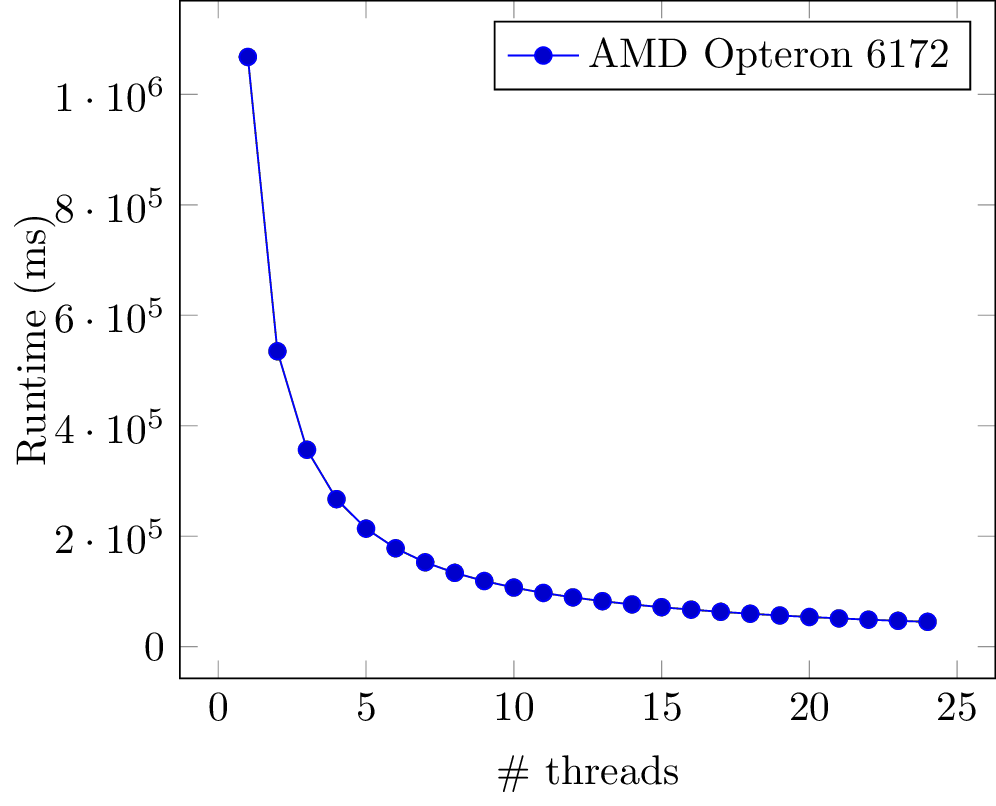

Reversed Words
==============

# Test results

These are the results for running the program
with a words file containing 123,398 words.

#### AMD Opteron 6172 12-core

| #threads | runtime (ms) | percentage |
|----------|--------------|------------|
|        1 | 1,067,772.54 |     100.00 |
|        2 |   534,877.78 |      50.09 |
|        3 |   356,563.76 |      33.39 |
|        4 |   267,132.82 |      25.02 |
|        5 |   213,741.00 |      20.02 |
|        6 |   178,142.22 |      16.68 |
|        7 |   152,713.21 |      14.30 |
|        8 |   133,665.50 |      12.52 |
|        9 |   118,826.96 |      11.13 |
|       10 |   106,998.49 |      10.02 |
|       11 |    97,292.78 |       9.11 |
|       12 |    89,218.46 |       8.36 |
|       13 |    82,385.38 |       7.72 |
|       14 |    76,515.68 |       7.17 |
|       15 |    71,446.52 |       6.69 |
|       16 |    67,026.26 |       6.28 |
|       17 |    63,078.10 |       5.91 |
|       18 |    59,622.92 |       5.58 |
|       19 |    56,500.00 |       5.29 |
|       20 |    53,720.23 |       5.03 |
|       21 |    51,185.62 |       4.79 |
|       22 |    48,889.30 |       4.58 |
|       23 |    46,806.99 |       4.38 |
|       24 |    44,945.82 |       4.21 |

#### Intel i5 6600K 3-core

| #threads | runtime (ms) | percentage |
|----------|--------------|------------|
|        1 |   341,107.02 |     100.00 |
|        2 |   167,841.67 |      49.20 |
|        3 |   112,575.05 |      33.00 |
|        4 |    87,578.18 |      25.67 |
